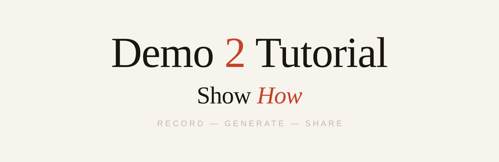
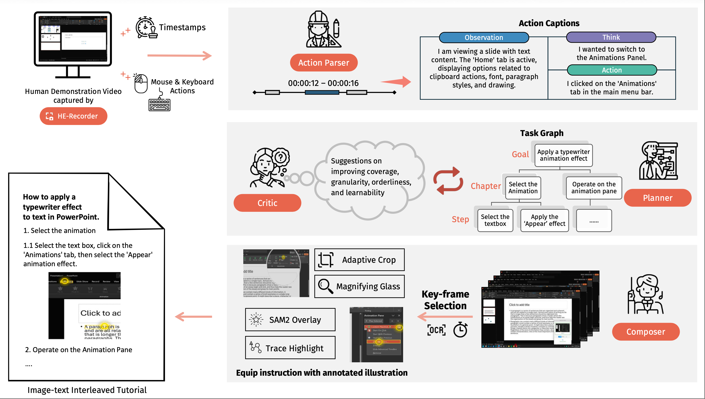
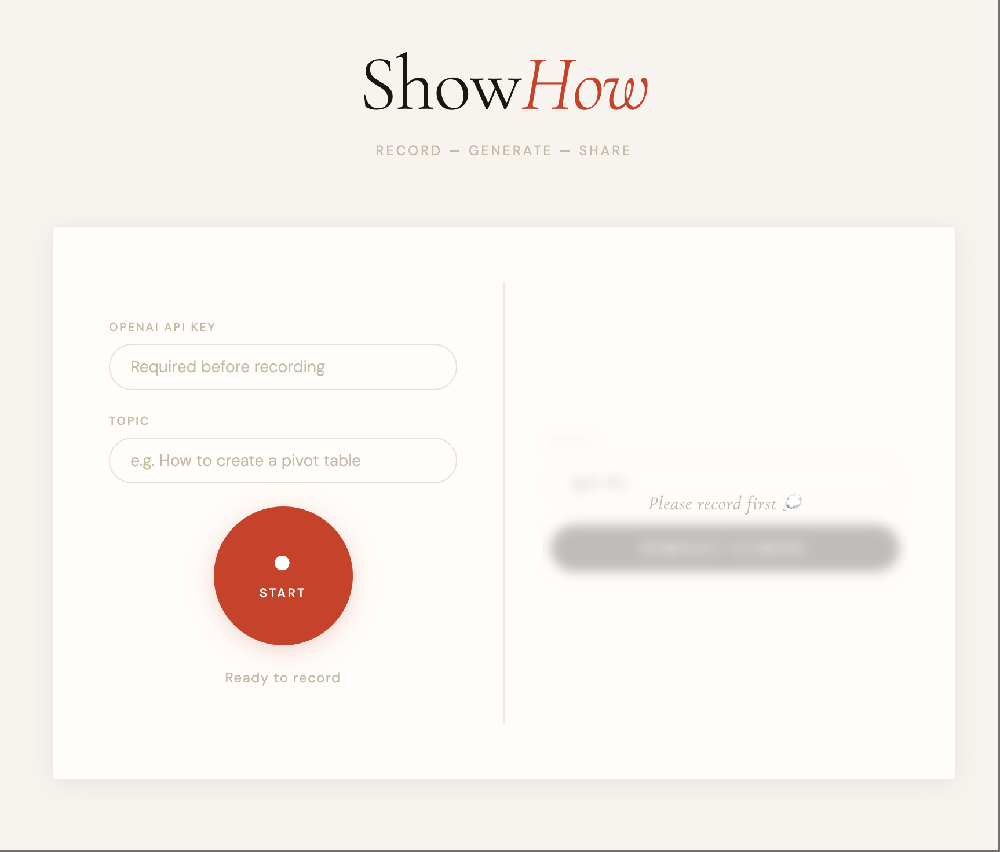

<p align="center">
  
</p>

<p align="center">
  <strong>Demo2Tutorial: From Human Experience to Multimodal Software Tutorials</strong>
</p>

<p align="center">
  Zechen Bai, Zhiheng Chen, Yiqi Lin, Kevin Qinghong Lin,<br>
  Difei Gao, Xiangwu Guo, Xin Wang, Mike Zheng Shou
</p>

<p align="center">
  Show Lab, National University of Singapore
</p>

<p align="center">
  
  
  
  
</p>

<p align="center">
  <a href="https://arxiv.org/abs/2606.03951">Paper</a> |
  <a href="https://pypi.org/project/showhow/">PyPI</a> |
  <a href="#quick-start">Quick Start</a>
</p>

<p align="center">
  <b>ShowHow</b> is the minimal public release of <b>Demo2Tutorial</b>: a lightweight tool for recording desktop workflows and turning them into polished step-by-step multimodal tutorials.
</p>

---

## Overview

Raw screen recordings are useful demonstrations, but they are often long, passive, and difficult to follow. `ShowHow` turns a recorded desktop workflow into a structured tutorial with concise instructions, selected keyframes, and visual guidance.

This repository keeps the paper-facing identity as **Demo2Tutorial**, while the public software tool and package are named **ShowHow**:

- repository: `Demo2Tutorial`
- Python package: `showhow`
- local tool / product name: `ShowHow`

## Highlights

### Current features

- Browser-based recording UI
- Local macOS recorder for desktop workflows
- Multimodal tutorial generation from recorded sessions
- Editable HTML/PDF export for generated tutorials
- PyPI package for simple installation

### Planned

- Windows support after a dedicated public validation pass
- Robust multi-monitor support after a dedicated validation pass
- MCP integration as a polished advanced workflow
- Skill-oriented integrations and broader agent-facing tooling

### Pipeline
<p align="center">
  
</p>

### Example Tutorial
<p align="center">
  
</p>

### Easy-to-use WebUI
<p align="center">
  
</p>

## Quick Start

### Option A: Install from PyPI

```bash
pip install showhow
python -m showhow.cli web --host 127.0.0.1 --port 18090
```

Then open (usually the browser will automatically open):

```text
http://127.0.0.1:18090
```

### Option B: Run from source directly

```bash
git clone https://github.com/showlab/Demo2Tutorial.git
cd Demo2Tutorial

python3 -m venv .venv
source .venv/bin/activate
pip install --upgrade pip
pip install -e .

python -m showhow.cli web --host 127.0.0.1 --port 18090
```

## Setup

### Requirements

- Python 3.10+
- `ffmpeg`
- OpenAI API access for generation
- macOS (Windows compatibility is not strictly tested)

### Current recording limitation

- This release is currently recommended for **single-display use only**.
- If multiple monitors are connected, recording, action capture, and frame alignment may be unreliable.
- For the best results, disconnect external monitors and perform the task on one screen.

### OpenAI API key

You can either:

- enter the API key directly in the web UI (still only exists locally)
- or export it in your shell

```bash
export OPENAI_API_KEY=your_key_here
```

### macOS permissions

For recording on macOS, you may need to grant these permission to `Terminal` or `iTerm2` if necessary:

- Screen Recording
- Accessibility
- Input Monitoring

If the recorder does not work as expected, run:

```bash
python -m showhow.cli doctor
```

## Usage

### Web UI

The recommended workflow is the web UI:

```bash
python -m showhow.cli web
```

Then:

1. open the local page in your browser
2. enter the API key if needed
3. start recording
4. perform the task
5. stop recording
6. generate the tutorial

### Interactive CLI flow

```bash
python -m showhow.cli record --topic "demo_flow" --generate --model gpt-4o
```

### Explicit CLI flow

```bash
python -m showhow.cli start --topic "demo_flow"
python -m showhow.cli rec-status
python -m showhow.cli stop
python -m showhow.cli generate --session-id <SESSION_ID>
```

## Output

By default, recordings are saved under:

```text
~/Downloads/record_save
```

Each session may produce artifacts such as:

- `events.jsonl`
- `metadata.json`
- session video
- parsed trace
- tutorial draft
- rendered tutorial assets
- `tutorial.html`

## Troubleshooting

### `ffmpeg` not found

Install `ffmpeg` and ensure it is available on your `PATH`.

### Recorder fails to start

Run:

```bash
python -m showhow.cli doctor
```

Then check:

- OS permissions
- recorder host/port availability
- `ffmpeg` availability

### OpenAI key errors

Make sure `OPENAI_API_KEY` is set correctly, or enter it in the web UI.

### No tutorial output generated

Check whether the recording session produced:

- a valid event log
- a valid video file
- a valid session directory under the record root

## Limitations

- Currently optimized for local single-user usage
- Default generation depends on API-backed captioning and planning
- Desktop recording behavior depends on OS permissions
- Some advanced composition features may require optional dependencies

## Citation

If you find this project useful, please cite the paper:

```bibtex
@inproceedings{bai2026demo2tutorial,
  title={Demo2Tutorial: From Human Experience to Multimodal Software Tutorials},
  author={Bai, Zechen and Chen, Zhiheng and Lin, Yiqi and Lin, Kevin Qinghong and Gao, Difei and Guo, Xiangwu and Wang, Xin and Shou, Mike Zheng},
  booktitle={Proceedings of the IEEE/CVF Conference on Computer Vision and Pattern Recognition},
  pages={29588--29597},
  year={2026}
}
```

## License

This project is released under the MIT License. See [LICENSE](LICENSE).
